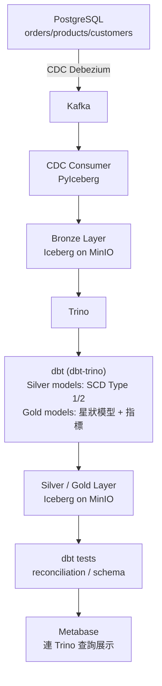

# 電商分析資料倉儲 (E-Commerce Analytics Data Warehouse)

## 專案簡介

模擬一家電商公司的分析型資料倉儲：即時捕捉交易資料庫的變更（CDC），存進 Iceberg 格式的 Bronze 層，透過 dbt 做 SCD 轉換與星狀模型建模，最終產出可供 BI 查詢的 Gold 層業務指標表。

## 系統架構



排程：Airflow 定期觸發 `dbt run` + `dbt test`，重新讀取 Bronze 層目前累積的全部資料，重算 Silver/Gold 層。

## 技術選型

| 環節 | 工具 | 說明 |
|---|---|---|
| 模擬交易資料 | Python + Faker | 產生訂單、商品、客戶假資料，並模擬商品改價事件 |
| 交易資料庫 | PostgreSQL | 啟用邏輯複製 (logical replication) 供 CDC 使用 |
| CDC | Debezium | 監聽 PostgreSQL WAL，捕捉 INSERT/UPDATE 事件 |
| 訊息佇列 | Kafka + Zookeeper | 承接 CDC 變更事件 |
| Connector 框架 | Kafka Connect | 執行 Debezium PostgreSQL connector |
| CDC Consumer | Python + PyIceberg | 消費 Kafka CDC 事件，寫入 Bronze 層 Iceberg table |
| Iceberg Catalog | Iceberg REST Catalog | 管理 Bronze/Silver/Gold 三層 Iceberg table 的 metadata |
| 物件儲存 | MinIO (S3 相容) | Iceberg table 底層資料檔案的儲存位置 |
| 查詢引擎 | Trino | 讀寫 Iceberg table，也是 dbt 的執行引擎 |
| 轉換 / 建模 | dbt (dbt-trino adapter) | Silver 層 SCD 邏輯（SQL window function）、Gold 層星狀模型 |
| 排程 | Apache Airflow | 定期觸發 `dbt run` + `dbt test` |
| 資料品質 | dbt tests | reconciliation、schema 驗證、referential integrity |
| 查詢展示 | Metabase | 連 Trino，視覺化營收趨勢 |

## 資料模型

### 來源層（PostgreSQL）
```
orders        (order_id, customer_id, order_date, status)
order_items   (order_item_id, order_id, product_id, quantity, unit_price)
products      (product_id, name, category, list_price, updated_at)
customers     (customer_id, name, email, city, segment, updated_at)
```

### Silver 層（dbt staging models，讀取 Bronze Iceberg table）
```
stg_products    -- 清洗、型別驗證，保留原始 CDC 事件粒度
stg_customers
stg_orders
stg_order_items
```

### Gold 層（星狀模型）
```
dim_products    (product_sk, product_id, name, category, list_price,
                 valid_from, valid_to, is_current)      -- SCD Type 2

dim_customers   (customer_sk, customer_id, name, city, segment)  -- SCD Type 1

dim_date        (date_sk, date, year, month, day, is_weekend, quarter)

fact_order_items (order_item_id, order_id, product_sk, customer_sk,
                  date_sk, quantity, unit_price, revenue)
```

### Gold 層（業務指標彙總表）
```
daily_revenue_summary (date_sk, total_revenue, order_count, avg_order_value)
```

## 核心設計決策

### 1. SCD Type 2（商品）vs SCD Type 1（客戶）

商品價格變動會直接影響歷史訂單的財務正確性——訂單金額必須反映下單當時的價格。客戶的城市、姓名變動只需要「現在」的狀態,歷史版本對分析沒有意義。判斷原則：**這個欄位的變動，是否會影響歷史事實的正確性計算**。

SQL 實作（`LEAD()` window function 取得下一個版本的起始時間，作為當前版本的結束時間）：

```sql
SELECT
    product_id, name, category, list_price,
    _cdc_ts_ms AS valid_from,
    LEAD(_cdc_ts_ms) OVER (PARTITION BY product_id ORDER BY _cdc_ts_ms) AS valid_to,
    LEAD(_cdc_ts_ms) OVER (PARTITION BY product_id ORDER BY _cdc_ts_ms) IS NULL AS is_current
FROM stg_products
```

### 2. Point-in-time Join

`fact_order_items` 寫入時查詢訂單時間對應到哪個 `product_sk` 版本（`valid_from <= 訂單時間 < valid_to`），不是直接用現在的商品狀態,確保歷史訂單金額永遠對應下單當時的價格。

### 3. 為什麼 Bronze 層用 Iceberg

Bronze 層由 CDC Consumer 持續寫入,檔案數量會隨時間不斷增加。Iceberg 的 metadata 機制讓查詢引擎不需要每次都掃描、打開所有實體檔案，可以先透過 metadata 過濾掉不相關的檔案。Silver/Gold 層因為是 dbt 每次整批重算、覆寫，不會有檔案持續累積的問題，不需要 Iceberg。

### 4. Reconciliation（資料品質防線）

dbt test 驗證 `fact_order_items` 的營收加總與 Bronze 層原始資料加總誤差在容許範圍內。若超標則擋住，不讓本次結果流向下游。

## 專案結構

```
ecommerce-data-warehouse/
├── data-generator/         # Faker 模擬資料生成腳本 + Dockerfile
├── cdc-consumer/           # Kafka CDC 事件消費者，用 PyIceberg 寫入 Bronze 層 + Dockerfile
├── connector-config.json   # Debezium PostgreSQL connector 設定
├── trino/
│   └── catalog/
│       └── iceberg.properties   # Trino 連接 Iceberg REST Catalog 的設定
├── dbt/
│   ├── dbt_project.yml
│   ├── profiles.yml
│   ├── models/
│   │   ├── staging/        # 讀取 Bronze Iceberg table
│   │   └── gold/            # SCD 邏輯、星狀模型、業務指標表
│   └── tests/               # reconciliation 與 schema 測試
├── airflow/
│   └── dags/
│       └── dbt_pipeline_dag.py   # 定期觸發 dbt run + dbt test
├── docker-compose.yml
├── requirements.txt         # data-generator 依賴
└── README.md
```

## 快速開始

```bash
docker compose up -d --build
docker compose ps
```

啟動後：
- **PostgreSQL**：`localhost:5432`（帳號 `ecom` / 密碼 `ecom_pw`，資料庫 `ecom_source`）
- **MinIO console**：http://localhost:9001（帳號 `minioadmin` / 密碼 `minioadmin`）
- **Kafka Connect REST API**：http://localhost:8083，Debezium PostgreSQL connector 由 `kafka-connect-init` 自動註冊
- **Trino**：http://localhost:8081
- **Airflow**：http://localhost:8090（帳號 `admin` / 密碼 `admin`）
- **Metabase**：http://localhost:3000

檢查各項服務：

```bash
# Debezium connector 狀態
curl http://localhost:8083/connectors/ecom-postgres-connector/status

# Trino 能否看到 Iceberg catalog
docker compose exec trino trino --execute "SHOW CATALOGS;"

# 用 Trino 查詢 Bronze 層資料
docker compose exec trino trino --execute "SELECT COUNT(*) FROM iceberg.bronze.products;"

# 手動觸發一次 dbt 執行
docker compose exec airflow-webserver bash -c "cd /opt/airflow/dbt && dbt run && dbt test"
```

## 開發筆記：CDC 實作過程中的關鍵問題

- **PostgreSQL `REPLICA IDENTITY`**：預設的 `DEFAULT` 模式下，UPDATE 事件的 `before` 欄位只會是 `null`。改成 `REPLICA IDENTITY FULL` 後才能拿到完整的舊資料，SCD Type 2 需要知道「改之前」的完整狀態才能正確判斷版本切換的時間點。
- **Kafka 雙 listener 設定**：需要同時提供「本機連線」與「容器對容器」兩種位址（`PLAINTEXT` / `PLAINTEXT_INTERNAL`）。
- **Decimal 型別編碼**：Kafka Connect 的 Decimal 型別在原始訊息中是 Base64 編碼的 bytes，CDC Consumer 端解碼，並逐筆與來源系統資料比對確認數值精度無誤。
- **已知限制：CDC Consumer 跨 topic 的 commit 粒度問題**：Consumer 同時監聽四個 topic，各自累積獨立的批次緩衝區，`enable_auto_commit` 已關閉，改為寫入成功後才手動 commit。但 Kafka 的 commit 是對所有 partition 位置整批提交，粒度是全域的，跟按各表獨立批次寫入的粒度不完全一致，理論上存在極小機率的資料遺失風險。業界標準做法是用 Kafka Connect 的官方 Sink Connector（例如 Confluent S3 Sink Connector）取代手寫 consumer；這裡選擇手寫是為了實際理解 offset/commit 機制。

## 已知邊界案例（開發時需驗證）

- 同一天內對同一商品連續改價兩次，`valid_from`/`valid_to` 是否會重疊或產生 gap
- 訂單時間剛好等於某個商品版本的 `valid_from` 時，該歸屬哪個版本（`>=` vs `>` 的邊界判斷）
- CDC 事件因網路延遲晚到，時間戳記與業務邏輯時間不一致時如何處理

## License

MIT