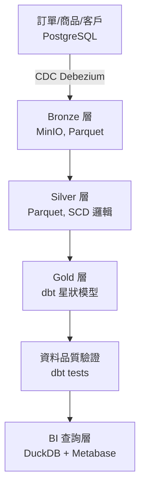

# 電商分析資料倉儲 (E-Commerce Analytics Data Warehouse)

## 專案簡介

模擬一家電商公司的分析型資料倉儲，整合交易資料庫的即時 CDC 事件，透過 Medallion 架構（Bronze/Silver/Gold）分層清洗，最終產出符合 Kimball 維度建模的星狀模型，供 BI 查詢與分析使用。

專案重點在於展示資料工程裡最常被考的三個核心能力：

1. **CDC（Change Data Capture）**：即時捕捉來源資料庫的變更，確保 Bronze 層資料與來源系統一致
2. **緩慢變化維度處理（SCD）**：正確保留歷史版本，確保歷史財務數字不被覆蓋
3. **資料品質保證（Reconciliation）**：Gold 層數字必須能對回 Bronze 層原始資料，誤差在容許範圍內才允許往下游流動

## 系統架構



**各層細節：**

- **來源層**：訂單/商品/客戶（PostgreSQL，透過 CDC 即時捕捉 INSERT/UPDATE）
- **Bronze 層**（MinIO, Parquet）：原始資料，append-only，不可修改
- **Silver 層**（Parquet）：清洗、去重、型別驗證、SCD Type 1 / Type 2 邏輯
- **Gold 層**（dbt + 星狀模型）：`dim_products`（SCD2）/ `dim_customers`（SCD1）/ `dim_date`；`fact_order_items`
- **資料品質驗證**：dbt tests / reconciliation
- **BI 查詢層**：DuckDB + Metabase

## 技術選型

| 環節 | 工具 | 說明 |
|---|---|---|
| 模擬交易資料 | Python + Faker | 產生訂單、商品、客戶假資料，並模擬商品改價事件；容器化執行 |
| 交易資料庫 | PostgreSQL | 啟用邏輯複製 (logical replication) 供 CDC 使用 |
| CDC | Debezium | 監聽 PostgreSQL WAL，捕捉 INSERT/UPDATE 事件 |
| Kafka 叢集協調 | Zookeeper | 管理 Kafka broker 資訊 |
| 事件流 | Kafka | 承接 CDC 變更事件 |
| Connector 執行框架 | Kafka Connect | 執行 Debezium PostgreSQL connector |
| CDC Consumer | Python (kafka-python) | 消費 Kafka CDC 事件，批次寫入 Bronze 層 |
| Bronze/Silver 儲存 | MinIO (S3 相容) + Parquet | 分層儲存；資料規模小，先以 Parquet + DuckDB 走完整個管線，Iceberg 留作後續加分項（見下方備註） |
| 轉換 / 建模 | dbt + DuckDB | Gold 層星狀模型建構與資料品質測試 |
| 排程 | Apache Airflow | 觸發 dbt run |
| 資料品質 | dbt tests + 自訂 reconciliation 測試 | 確保 Gold 層與 Bronze 層數字一致 |
| 查詢展示 | Metabase | 視覺化營收趨勢與 SCD Type 2 正確性對比 |

> **備註：為什麼不用 Iceberg**
> Iceberg 的 schema evolution、time travel、partition pruning 等能力，在資料量大（百萬筆以上、多檔案、需要頻繁按時間範圍查詢）時才會發揮明顯價值。這個專案的資料規模小（測試資料約幾百到幾千筆），用 Parquet + DuckDB 查詢已經是毫秒級，加 Iceberg 不會帶來可感知的效能差異，反而會增加額外的維運複雜度（catalog 服務、版本相容性管理）。等核心邏輯（SCD、point-in-time join、reconciliation）都做完且穩定後，若有餘力會考慮把儲存格式升級成 Iceberg。

## 資料模型

### 來源層（PostgreSQL）
```
orders        (order_id, customer_id, order_date, status)
order_items   (order_item_id, order_id, product_id, quantity, unit_price)
products      (product_id, name, category, list_price, updated_at)
customers     (customer_id, name, email, city, segment, updated_at)
```

### Gold 層（星狀模型）
```
dim_products    (product_sk, product_id, name, category, list_price,
                 is_current, valid_from, valid_to)      -- SCD Type 2

dim_customers   (customer_sk, customer_id, name, city, segment)  -- SCD Type 1

dim_date        (date_sk, date, year, month, day, is_weekend, quarter)

fact_order_items (order_item_id, order_id, product_sk, customer_sk,
                  date_sk, quantity, unit_price, revenue)
```

## 核心設計決策

### 1. 為什麼商品用 SCD Type 2，客戶用 SCD Type 1

商品價格變動會直接影響歷史訂單的財務正確性——三個月前的訂單金額必須反映當時的價格，不能因為現在改價就往回改。客戶的城市、姓名變動則通常只需要「現在」的狀態，用於現在的行銷分群，歷史版本對大部分分析沒有意義。判斷原則：**這個欄位的變動，是否會影響歷史事實的正確性計算**。

### 2. Point-in-time Join

`fact_order_items` 寫入時，不是存 `product_id`，而是根據訂單時間去查詢當時哪個 `product_sk` 版本生效，直接寫入正確的代理鍵。這樣後續查詢完全不需要額外的時間判斷邏輯，歷史訂單自動對應到當時的正確價格。

### 3. 為什麼選擇 CDC，而不是排程批次拉取

訂單、商品、客戶都是自己有資料庫存取權的系統，CDC 可以做到近乎即時捕捉變更，且不需修改應用程式碼（不像批次拉取需要應用程式主動配合、或排程查詢造成資料庫額外負擔）。

### 4. Reconciliation（資料品質防線）

每次 Gold 層跑完，驗證 `fact_order_items` 的營收加總與 Bronze 層原始資料加總的誤差是否在容許範圍內（例如 0.01%）。若超標則擋住，不讓本次結果流向下游——寧可提供昨天的舊資料，也不提供今天可能有誤的資料。

## Gold 層儲存方式說明

Gold 層資料實際落地存進一個本機的 `.duckdb` 檔案（透過 `dbt-duckdb` adapter），不是每次查詢都重新讀取 MinIO 上的 Parquet 檔案。這樣查詢時資料已經是常駐、整理好的格式，體感上更接近一般資料庫（如 ClickHouse）的查詢速度，也方便 Metabase 直接連線。

## 專案結構

```
ecommerce-data-warehouse/
├── data-generator/        # Faker 模擬資料生成腳本 + Dockerfile
├── cdc-consumer/          # Kafka CDC 事件消費者，批次寫入 Bronze 層 + Dockerfile
├── connector-config.json  # Debezium PostgreSQL connector 設定
├── dbt/                   # dbt models（Silver SCD 邏輯 + Gold 星狀模型）
│   ├── models/
│   │   ├── silver/
│   │   └── gold/
│   └── tests/             # reconciliation 與 schema 測試
├── dags/                  # Airflow DAG
├── docker-compose.yml
├── requirements.txt       # data-generator 依賴
└── README.md
```

## 快速開始

整套環境已完全容器化，一行指令即可啟動全部服務（PostgreSQL、MinIO、Zookeeper、Kafka、Kafka Connect + Debezium、資料生成器、CDC Consumer）：

```bash
docker compose up -d --build
docker compose ps
```

啟動後：
- **PostgreSQL**：`localhost:5432`（帳號 `ecom` / 密碼 `ecom_pw`，資料庫 `ecom_source`）
- **MinIO console**：http://localhost:9001（帳號 `minioadmin` / 密碼 `minioadmin`），`bronze` bucket 由 `minio-init` 自動建立
- **Kafka Connect REST API**：http://localhost:8083，Debezium PostgreSQL connector 由 `kafka-connect-init` 自動註冊
- **資料生成器**：容器化執行，啟動後自動 seed 200 筆客戶、50 筆商品，並持續產生訂單、隨機模擬改價/客戶更新事件
- **CDC Consumer**：容器化執行，持續消費四個 CDC topic，批次寫入 Bronze 層（累積 50 筆或每 10 秒，先到者觸發寫入）

檢查各項服務是否正常運作：

```bash
# PostgreSQL 資料是否持續產生
docker compose exec postgres psql -U ecom -d ecom_source -c "SELECT COUNT(*) FROM orders;"

# Debezium connector 狀態是否為 RUNNING
curl http://localhost:8083/connectors/ecom-postgres-connector/status

# CDC Consumer 是否持續寫入 Bronze 層
docker compose logs cdc-consumer

# CDC 事件是否即時進入 Kafka（手動驗證用）
# （在另一個終端機視窗執行下方指令監聽，接著改一筆商品價格觸發事件觀察）
docker compose exec kafka kafka-console-consumer \
  --bootstrap-server localhost:9092 \
  --topic ecom.public.products
```

## 開發筆記：CDC 實作過程中的關鍵問題

- **PostgreSQL `REPLICA IDENTITY`**：預設的 `DEFAULT` 模式下，UPDATE 事件的 `before` 欄位只會是 `null`（只靠主鍵識別被改的列，不會帶出舊值）。改成 `REPLICA IDENTITY FULL` 後才能拿到完整的舊資料，這對後續 Silver 層要做 SCD Type 2 邏輯是必要的——需要知道「改之前」的完整狀態才能正確判斷版本切換的時間點。
- **Kafka 雙 listener 設定**：需要同時提供「本機連線」與「容器對容器」兩種位址（`PLAINTEXT` / `PLAINTEXT_INTERNAL`），否則本機工具連不上、或容器間互相連不上。
- **為什麼沒有獨立的批次落地腳本**：Debezium 第一次啟動時的 initial snapshot，會自動把資料庫現有資料整批轉換成事件送進 Kafka，這個功能與原本規劃的「一次性批次匯出」腳本高度重疊，因此移除重複的批次腳本，統一由 CDC 管線處理歷史資料與即時變更。
- **Decimal 型別編碼**：Kafka Connect 的 Decimal 型別（如 `list_price`、`unit_price`）在原始訊息中是 Base64 編碼的 bytes，已在 CDC Consumer 端解碼，並逐筆與來源系統資料比對，確認數值精度無誤。
- **Bronze 層資料完整性驗證**：CDC Consumer 消費四個 topic 的事件，累積達到 50 筆或每 10 秒（先到者）批次寫入 Parquet 到 MinIO。經過驗證，`order_items` 在 Bronze 層的總筆數與 PostgreSQL 來源完全一致（1571 = 1571），且逐筆數值正確。
- **已知限制：跨 topic 的 commit 粒度問題**：CDC Consumer 同時監聽四個 topic，各自累積獨立的批次緩衝區，`enable_auto_commit` 已關閉，改為寫入 MinIO 成功後才手動呼叫 `commit()`，避免「offset 已提交、但資料未落地」導致的漏資料風險。但 Kafka 的 `commit()` 是對「這個 consumer 目前讀到的所有 partition 位置」整批提交，粒度是全域的；而寫入 Bronze 層的動作是按各表獨立批次進行的，兩者粒度不完全一致。當某個表的事件量遠高於其他表時，理論上存在極小機率的資料遺失風險。
  - **業界標準做法**：這類「Kafka → 物件儲存」的資料搬遷，業界通常使用 Kafka Connect 的官方 Sink Connector（例如 Confluent S3 Sink Connector），透過框架本身內建的 offset 管理機制保證正確性，而非自行手寫 consumer 處理 commit 邏輯。
  - **這裡選擇手寫 consumer 的原因**：為了實際理解 Kafka consumer 的 offset/commit 機制與其邊界情況。若要用於正式生產環境，會改用官方 Sink Connector 取代這支手寫程式。

## 已知邊界案例（開發時需驗證）

- 同一天內對同一商品連續改價兩次，`valid_from`/`valid_to` 是否會重疊或產生 gap
- 訂單時間剛好等於某個商品版本的 `valid_from` 時，該歸屬哪個版本（`>=` vs `>` 的邊界判斷）
- CDC 事件因網路延遲晚到，時間戳記與業務邏輯時間不一致時如何處理

## License

MIT